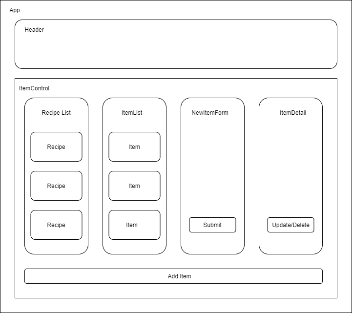

#  FRIGO

### A web application that helps busy people stay organized in the kitchen and . May 9th, 2020
#### _By: Hristo Dzhambov_

------------------------------
## 🌐 About the Project

### Component Tree


------------------------------

## 📖 Description

_Meal planning is hard, especially if you have a demanding job and a family. Frigo will help these struggling individuals and families by reminding them about what is on their grocery list, reduce food waste and come up with delicious and nutritious recipes._


## Specifications
* The user is able to create, read, and update taps in the tap room.
* The user is able to submit a form to add a new kegs to a list.
* The user is able to click on a keg to see its detail page.
* The user is able to see how many pints are left in a keg.
* The user is able to sell a pint from the list and the quantity is reduced by 1.
* When the quantity of a tap reaches 0, the user will get a message "out of stock". A user should not be able to see quantity of a tap below 0.

------------------------------

## ⚙ Setup/Installation Requirements

#### Node install

##### _For macOS_:
_If Homebrew is not installed on your computer already, then install Homebrew by entering the following two commands in Terminal:_
* $ /usr/bin/ruby -e "$(curl -fsSL https://raw.githubusercontent.com/Homebrew/install/master/install)"
* $ echo 'export PATH=/usr/local/bin:$PATH' >> ~/.bash_profile

_Install Git with the following command:_
* $ brew install git

_Next, install Node.js by entering the following command in Terminal:_
* $ brew install node

##### _For Windows_:
_Please visit the [Node.js website](https://nodejs.org/en/download/) for installation instructions._

#### Install this application

_Clone this repository via Terminal using the following commands:_
* _$ cd desktop_
* _$ git clone {https://github.com/dzhambov/Tap-Room-React}_
* _$ cd Tap-Room-React_
* _Confirm that you are in the correct directory by typing pwd_
* _Install npm at the project's root directory_
* _$ npm install_
* _$ npm run build_
* _$ npm install --save-exact react-scripts@3.2.0_

------------------------------

## 🦠 Known Bugs

_There are no known bugs at this time._

------------------------------

## ✉️ Support and Contact Details

_Have a bug or an issue with this application? [Open a new issue](https://github.com/dzhambov/Tap-Room-React/issues) here on GitHub._

------------------------------

## 🖥️ Technologies Used

* React
* JavaScript
* Webpack
* Git
* npm


------------------------------

## ⚖ License

This project is licensed under the [MIT License](https://opensource.org/licenses/MIT). Copyright (c) 2020 Amber Doe Jr. All Rights Reserved.
```
MIT License

Copyright (c) 2020 Hristo Dzhambov

Permission is hereby granted, free of charge, to any person obtaining a copy
of this software and associated documentation files (the "Software"), to deal
in the Software without restriction, including without limitation the rights
to use, copy, modify, merge, publish, distribute, sublicense, and/or sell
copies of the Software, and to permit persons to whom the Software is
furnished to do so, subject to the following conditions:

The above copyright notice and this permission notice shall be included in all
copies or substantial portions of the Software.

THE SOFTWARE IS PROVIDED "AS IS", WITHOUT WARRANTY OF ANY KIND, EXPRESS OR
IMPLIED, INCLUDING BUT NOT LIMITED TO THE WARRANTIES OF MERCHANTABILITY,
FITNESS FOR A PARTICULAR PURPOSE AND NONINFRINGEMENT. IN NO EVENT SHALL THE
AUTHORS OR COPYRIGHT HOLDERS BE LIABLE FOR ANY CLAIM, DAMAGES OR OTHER
LIABILITY, WHETHER IN AN ACTION OF CONTRACT, TORT OR OTHERWISE, ARISING FROM,
OUT OF OR IN CONNECTION WITH THE SOFTWARE OR THE USE OR OTHER DEALINGS IN THE
SOFTWARE.
```

------------------------------
